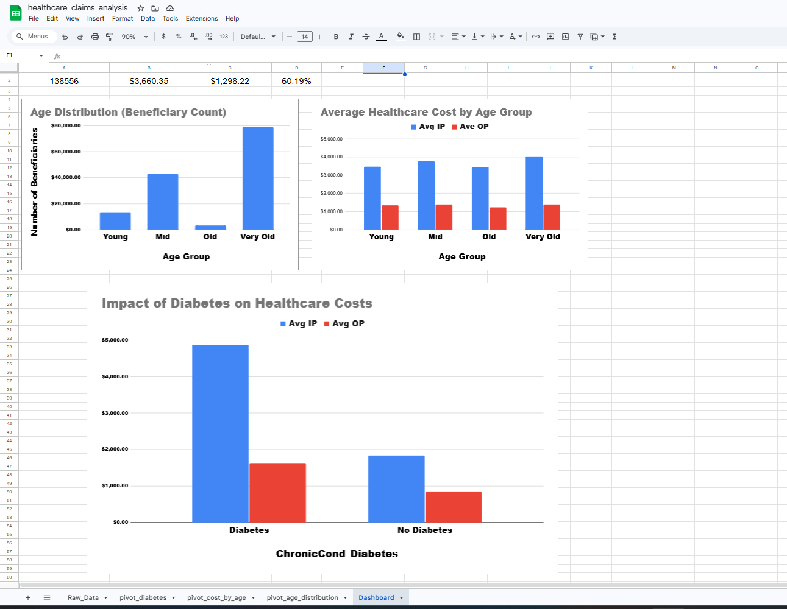

# Healthcare Claims SQL Analysis

SQL-based analysis of healthcare claims data to identify trends in utilization, reimbursement patterns, and population demographics.

---

## Overview

This project analyzes Medicare beneficiary data using SQL to uncover patterns in healthcare utilization, cost distribution, and the impact of chronic conditions on reimbursement.

---

## Population Distribution by Age Group

The dataset is heavily concentrated in older populations, with over 88% of beneficiaries classified as “Old” or “Very Old.” This aligns with Medicare’s target demographic and indicates that observed utilization and cost patterns are primarily driven by age-related healthcare needs.

---

## Healthcare Cost Trends by Age Group

Inpatient reimbursement increases with age, peaking in the “Very Old” group, suggesting a greater reliance on intensive and high-cost healthcare services in later life stages.

In contrast, outpatient reimbursement remains relatively stable across age groups, indicating that routine care utilization is consistent, while cost escalation is primarily driven by inpatient services.

This highlights inpatient care as a key contributor to rising healthcare costs in aging populations.

---

## Chronic Condition Impact on Reimbursement

Beneficiaries with diabetes incur significantly higher healthcare costs compared to those without diabetes. Average inpatient reimbursement for diabetic patients (4870.62) is more than double that of non-diabetic patients (1830.82).

A similar pattern is observed in outpatient reimbursement, indicating consistently higher utilization across care settings.

These findings suggest that diabetes is a major driver of healthcare cost escalation and emphasize the importance of proactive chronic condition management strategies.

---

## High-Cost Beneficiary Patterns

High-cost utilization is concentrated among beneficiaries in the “Old” and “Very Old” groups, with top reimbursement values ranging from $171,190 to $262,720.

This indicates that a relatively small subset of beneficiaries accounts for a disproportionate share of total healthcare spending, highlighting opportunities for targeted intervention, care coordination, and cost containment.

---

## Business Impact

This analysis demonstrates how SQL can be used to transform raw healthcare data into actionable operational insights.

Potential applications include:

- Identifying age groups associated with higher inpatient cost burden  
- Highlighting chronic condition populations that may benefit from proactive care management  
- Supporting resource planning by revealing utilization patterns across beneficiary segments  
- Enabling healthcare organizations to focus cost-containment strategies on high-impact populations  

These insights support more informed decision-making in utilization management, care coordination, and cost optimization initiatives.

---

## Dashboard

An interactive dashboard was created in Google Sheets to visualize key insights from the dataset, including age distribution, healthcare cost trends, and the impact of chronic conditions.

[View Interactive Dashboard](https://docs.google.com/spreadsheets/d/112zTg3MeRmX77Tkv7OCb7gLkWNcYsch_6_Ustr1eruI/edit?usp=sharing)

---

## Dashboard Preview



---

## Project Structure

```
healthcare-claims-sql-analysis/
├── data/
│   └── ProviderFraud.csv
├── sql/
│   └── healthcare_sql_analysis.sql
└── README.md
```

---

## How to Run This Project

1. Open SQLite  
2. Import the dataset using `.mode csv` and `.import`  
3. Run the SQL script located in `/sql/healthcare_sql_analysis.sql`  
4. Execute analysis queries to reproduce insights  

---

## Tools Used

- SQLite  
- SQL  

---

## Skills Demonstrated

- Data cleaning and transformation  
- Data type casting and standardization  
- Aggregation and grouping  
- Conditional logic using CASE statements  
- Healthcare data analysis and insight generation  

---

## Summary

This project demonstrates an end-to-end analytics workflow, from raw data ingestion and transformation to insight generation and dashboard visualization using SQL.

---

## Future Improvements

- Extend analysis to additional chronic conditions  
- Incorporate time-based trends if longitudinal data is available  
- Develop a Power BI or Excel dashboard for enhanced interactivity  
